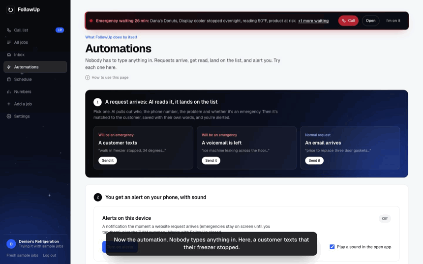
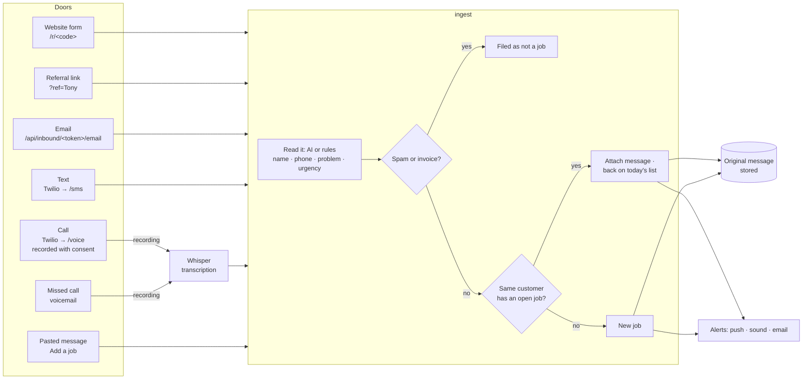
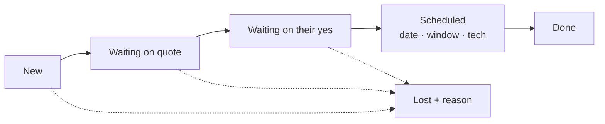
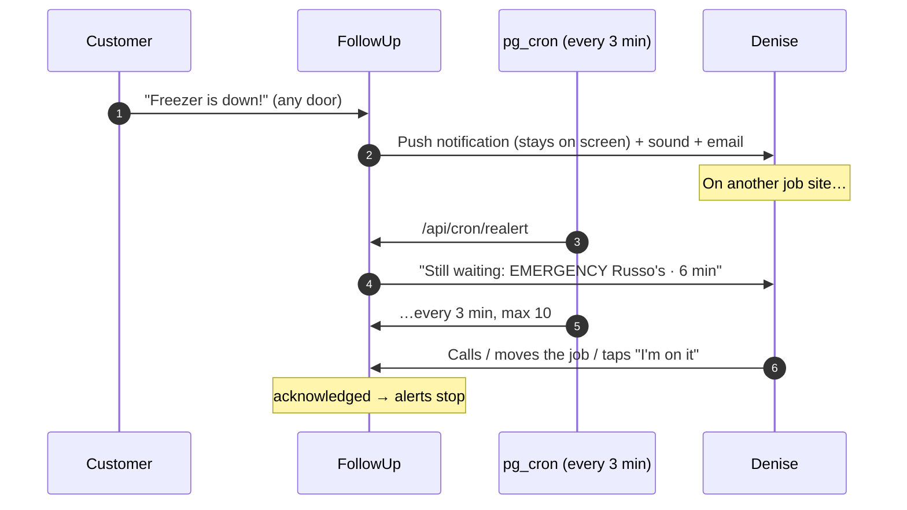
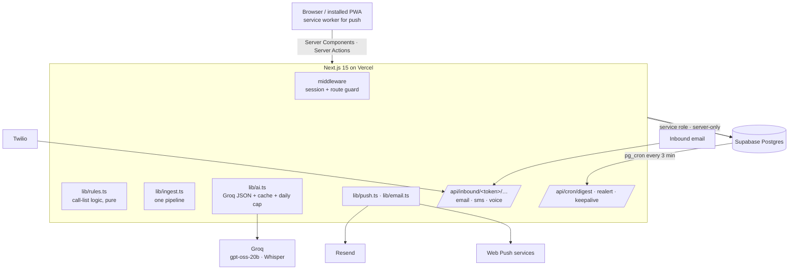
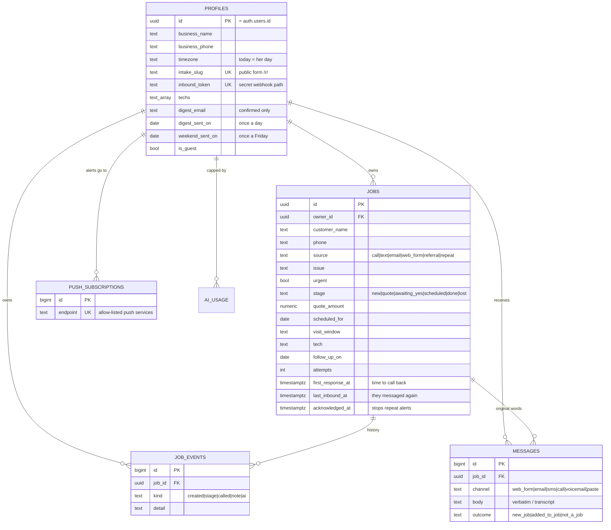

<div align="center">


# FollowUp

**Every job request in one place. Every morning, one list of who to call and why.**

A lead and follow-up system for a small commercial refrigeration repair company,
built from one discovery call with its owner.

[**Live app**](https://followup-indol-seven.vercel.app) · [**Write-up**](docs/WRITEUP.md) · [**How to test it**](docs/TESTING.md) · [Edge cases](docs/EDGE-CASES.md) · [Decisions](docs/DECISIONS.md)


<a href="https://followup-indol-seven.vercel.app/#tour"></a>

**▶ [Watch the 4-minute narrated tour on the website](https://followup-indol-seven.vercel.app/#tour)** · [direct video link](https://followup-indol-seven.vercel.app/explainer.mp4)

</div>

---

## Contents

[Start here](#start-here) · [The problem](#the-problem-in-her-words) · [What it does](#what-it-does) · [Five doors, one pipeline](#five-doors-one-pipeline) · [Who lands on the call list](#who-lands-on-the-call-list) · [Alerts](#alerts-she-cannot-miss) · [Architecture](#architecture) · [Data model](#data-model) · [Where AI is used](#where-ai-is-used-and-where-it-isnt) · [Security](#security) · [Tests](#tests) · [Run it](#run-it-locally) · [How it was built with Claude Code](#how-it-was-built-with-claude-code) · [Scope](#what-i-left-out-on-purpose) · [Next](#what-id-build-next)

---

## Start here

| If you have… | Read |
|---|---|
| 1 minute | The [live app](https://followup-indol-seven.vercel.app): press **Try the demo** |
| 4 minutes | The [narrated tour](https://followup-indol-seven.vercel.app/#tour) |
| 5 minutes | The [write-up](docs/WRITEUP.md): what I heard, the real problem, what I built, what I left out, rollout, cost, questions for Denise |
| 15 minutes | [How to test every automation by hand](docs/TESTING.md) |

---

## The problem, in her words

Denise runs a commercial refrigeration repair company: 4 technicians, 15–20 new requests a week, mostly restaurants and grocery stores.

> "Some people call my cell, some fill out the form on our website, some just text me. I have a notebook too. It is a mess."
>
> "A restaurant called on a Friday, freezer down, and I forgot to follow up… by Monday they had called someone else. That is a two thousand dollar job gone."
>
> "I just want to wake up and know who I need to call today. Waiting on quote, waiting on their yes, scheduled, done. I don't need anything fancy."

**The real problem** isn't a lack of leads. Money leaks in the gap between *a request arriving* and *someone calling back*, because requests are spread across five places and nothing reminds her when one goes cold. FollowUp closes that gap.

| She said | What FollowUp does |
|---|---|
| "Scattered in five places" | Calls, voicemails, texts, emails, website form and referrals all flow into **one pipeline** and **one list** |
| "Wake up and know who to call" | The **Call list**: who to call, why, emergencies first. Also as a **7 AM email + phone alert** |
| "Freezer down… by Monday they called someone else" | **Emergency alerts** to her phone instantly, **repeating every 3 minutes** until she acts, and a **Friday 3 PM check** for anything that would wait until Monday |
| "Did I send the quote? Did they say yes?" | Her own stage names, one-tap next step, full history on every job |
| "My husband keeps asking for numbers" | **Numbers**: money waiting, win rate, time to call back, why jobs are lost |
| Tech scheduling: "nice later" | Kept simple: assign a tech + arrival window, a 14-day **Schedule** |

---

## See the automation in 60 seconds

1. Open the [live app](https://followup-indol-seven.vercel.app) → **Try the demo** (a private copy with sample jobs, no signup).
2. Go to **Try it** (shown only in the demo) → press **Send** on "A customer texts". The message is read by AI, flagged as an emergency, matched to a customer, saved with their own words, and an alert fires (sound in the app, a push notification if alerts are on).
3. Back on the **Call list**, it's on top, with a dark emergency bar that re-alerts every 3 minutes until you press **I'm on it**.
4. On **Try it**, open "See the emails Denise gets" for the real **emergency email** and the **7 AM call-list email** FollowUp sends.

Every other automation (phone notifications, emails, the 7 AM list, the Friday check, the email and text doors) has a step-by-step check in [docs/TESTING.md](docs/TESTING.md).

## What it does

| Screen | For Denise |
|---|---|
| **Call list** | Who to call today and why, emergencies first, an AI "today" brief, one-tap *No answer → tomorrow*, *Coming up*, time to call back |
| **Try it** *(demo only)* | Pretend to be a customer and watch a request arrive by itself. Real accounts don't see it: their requests are real |
| **Inbox** | Every call, text, email and website request in the customer's own words |
| **Job page** | Call / text, the next step as one question, what the customer said, AI-drafted follow-up, history with dates |
| **All jobs · Schedule · Numbers** | Stages, visits by day / window / technician, money and why jobs were lost |
| **Settings → Connect** | One-time setup for the website form, referrals, email and a phone number |

**Also:** public request form (`/r/<code>`) with an "equipment is down" box · referral links (`?ref=Tony`) · paste a message and AI fills the job · repeat customers recognised by phone · lost reasons from a fixed list · 3 unanswered tries → "mark lost?" (never automatic) · themed date picker with quick picks · password reset · one-click private demo.

---

## Five doors, one pipeline

Every channel calls the same function, [`lib/ingest.ts`](lib/ingest.ts). The customer's original words (or call transcript) are always stored.



| Door | Status | Identity trusted for matching |
|---|---|---|
| Website form, referral link | **Live** | Only jobs that also came from the form (anyone can type a phone number) |
| Pasted message | **Live** | Signed-in owner |
| Email | Built · needs inbox forwarding | Sender address, only against jobs earlier emails from that address created |
| Text, call, voicemail | Built · needs a Twilio number | Caller ID from the phone network, verified by Twilio's HMAC signature |

Calls ring through to her cell after a "this call may be recorded" notice (two-party-consent states), are recorded both sides, transcribed with Groq Whisper and turned into a job. Unauthenticated doors (form, email) can surface a job and alert her, but **can't change urgency or her reminders** on an existing job.

---

## Who lands on the call list

Pure functions in [`lib/rules.ts`](lib/rules.ts): no database, no clock of their own, fully unit-tested. "Today" is the shop's time zone, not the server's.

| Situation | On the list | Says |
|---|---|---|
| New + urgent | Immediately, always first | **Call now** |
| They wrote/called again, unanswered | Immediately | **Reply** · "They messaged 10 min ago" |
| New | Immediately (overdue after 24 h) | **Call back** |
| Waiting on quote | Immediately (overdue after 24 h) | **Send quote** |
| Waiting on their yes | After **2 quiet days** | **Follow up** · "$2,400 quote · quiet 4 days" |
| Said yes, no date | Immediately | **Pick a date** |
| Visit date passed | Next day | **Mark done** |
| A date she set / *No answer* | That day; after 3 tries suggests **mark lost?** | **Call** / **Last try** |



---

## Alerts she cannot miss



- **Web Push** (VAPID) to phone or computer, even with the app closed; emergencies use `requireInteraction` and open the job on tap. Installable PWA (iOS 16.4+ needs Home Screen).
- **In the open app**: a chime for new requests, an urgent triple beep for emergencies (Web Audio, no files), flashing tab title, a red bar on every page, live refresh every 20 s.
- **Repeat**: Supabase `pg_cron` + `pg_net` hit `/api/cron/realert` every 3 minutes (Vercel's free plan only runs daily crons). The auth token is generated inside the database and never committed.
- **Friday 3 PM check**: the same 3-minute job sends one notification + email per business on Friday afternoon (shop time) listing what's still on the list or due Saturday–Monday. The call list shows the same as a banner. Claimed once per Friday.
- **Email** (Resend): instant alert per request (display name = the customer, Reply goes to them), the 7 AM list and the Friday check, each claimed atomically so it can never double-send. The deployment uses Resend's test sender, which only delivers to the account owner until a domain is verified.

---

## Architecture



**Stack:** Next.js 15 (App Router, Server Actions) · TypeScript · Tailwind v4 · Supabase (Postgres, Auth, RLS, pg_cron, pg_net) · Groq (`openai/gpt-oss-20b`, `whisper-large-v3-turbo`) · Resend · Web Push · Vercel · Vitest · Playwright.

---

## Data model



Also: `ai_cache` (hash → result), `form_hits` (rate limiting, hashed IPs), `app_secrets` (server-only). Migrations live in [`supabase/migrations`](supabase/migrations).

---

## Where AI is used, and where it isn't

| Used for | Why AI | Fallback without a key |
|---|---|---|
| Reading a pasted text / email / transcript into job fields | Messy human text | Regex extraction (phone, name, business) |
| Is this an emergency? (only when rules are unsure) | Ambiguous wording | Rules decide alone |
| Is this a job at all? (spam, invoices) | Judgment on free text | Keyword filter |
| Drafting a follow-up text | Tone | Templates per stage |
| Call / voicemail transcription | Speech | Job still created, "listen to the recording" |

**Not AI:** who's on the call list, ordering, matching customers, stages, numbers. Those are plain, tested code, so Denise can always see *why* someone is on her list. AI can only **raise** urgency, never lower it: a missed emergency costs ~$2,000, a false alarm costs one phone call. Answers are cached by hash and capped per business per day.

---

## Security

- **Row-Level Security on every table:** a business only ever sees its own rows (`owner_id = auth.uid()`), enforced by Postgres, not by app code. History entries can only be attached to jobs you own.
- **Column-level GRANTs** on `profiles`: users can't flip `is_guest`, the webhook token or the "sent today" marker.
- **Webhooks:** a 128-bit per-business token in the path; Twilio requests verified with HMAC-SHA1 signatures; recordings fetched only from `api.twilio.com` (no SSRF).
- **Public form:** honeypot field, rate limit (5 per visitor per 10 min, IPs hashed), can't edit jobs it didn't create.
- **Email:** sent only to the owner's *confirmed* address (DB trigger on confirmation), never from the demo; display name sanitized and quoted.
- **Push:** endpoints allow-listed to real push services by a DB `CHECK` and in code; devices can't be taken over by another account.
- **Server-only service role** (`server-only` import fails the build if it ever reaches the browser). Zod validation on every input.

An automated security review ran on every commit and flagged **12 issues** during development (an email relay through the demo, SSRF via push endpoints, a race condition on the daily email, identity spoofing on email matching, and others). All were fixed, and the fixes were proven with tests that attempt each attack.

---

## Tests

```bash
npm test          # 46 unit tests: call-list rules, snooze/coming-up, time to call back, repeat-alert policy,
                  # Friday check, triage, phone matching, AI fallbacks, Twilio signatures, email escaping
npm run e2e       # 4 Playwright tests in real Chrome: demo flow, stages + CSV, route protection,
                  # website request → emergency on the owner's list
npm run lint && npm run typecheck
```

[CI](.github/workflows/ci.yml) runs lint, types, unit tests and the build on every push; the browser tests run on demand against a throwaway Supabase.

---

## Run it locally

Requires Node 20+ and Docker.

```bash
npm install
npx supabase start                 # local Postgres + Auth (prints keys)
cp .env.example .env.local         # paste the local URL + keys
npx supabase db reset              # tables, policies, demo seed
npm run dev -- -p 3200             # http://localhost:3200 → Try the demo
```

**Deploy:** `npx supabase link && npx supabase db push`, turn on anonymous sign-ins (for the demo), then `bash scripts/setup-vercel-env.sh` (copies keys into Vercel, generates push keys and the cron secret, prompts for Groq/Resend with hidden input) and `vercel deploy --prod`. All variables are documented in [`.env.example`](.env.example).

---

## How it was built with Claude Code

I built FollowUp with Claude Code as the engineer and myself as the product owner and reviewer. AI wrote most of the code; I decided what to build, what *not* to build, and checked that every screen did what Denise needed. The workflow:

| Practice | What it looked like here |
|---|---|
| **Context before code** | Wrote the [PRD](docs/PRD.md), [TRD](docs/TRD.md), [system design](docs/SYSTEM-DESIGN.md) and [edge cases](docs/EDGE-CASES.md) *before* the first line of code, so every session started from the same understanding of Denise's problem. |
| **Every feature traced to her words** | The [decisions log](docs/DECISIONS.md) (22 entries) records each choice, why, and the rejected alternative, e.g. "rules decide the call list, not AI". |
| **Tools wired in, not pasted in** | Plugins: `frontend-design`, `feature-dev`, `code-review`, `security-guidance`. MCP / CLIs: Supabase (migrations pushed from the terminal), Vercel (deploys, env checks), Context7 (current library docs), a browser for verification. |
| **Verify, don't trust** | After each feature: unit tests, Playwright, scripted click-throughs in headless Chrome, and screenshots at laptop and phone width, reviewed before every deploy. Bugs found this way included a React 19 form reset that lost typed input and a stepper rendering glitch. |
| **Security review on every commit** | The `security-guidance` hook reviewed each commit; 12 findings, each fixed and proven with an attack test (e.g. 5 simultaneous "send" clicks → exactly 1 email). |
| **Research, then judgment** | Looked at award-winning SaaS sites for the visual direction and at other approaches to the same brief for gaps; took ideas only where they traced back to Denise's call, and wrote everything fresh. |
| **Honest limits** | What needs a paid phone number or email forwarding is built and testable through the simulator, and labelled as such rather than faked. |

---

## What I left out on purpose

- **Full dispatch / route planning.** She said "nice later… I kind of know where everyone is", so it's a simple tech + window + 14-day view.
- **Sending quotes, invoices, payments.** She asked to *track* quotes, not send them; her husband does the books.
- **Auto-texting customers.** She owns the relationship (and US A2P rules apply); FollowUp drafts, she sends.
- **Charts for their own sake.** "I don't need anything fancy." Every number on the Numbers page answers a question someone asked.

## What I'd build next

1. **Turn on the Twilio number**: the call/text/voicemail pipeline is built and signature-checked; it needs a number and two keys.
2. **Forward her inbox** to the email door.
3. **Per-person logins** (owner, office, tech) with an audit trail.
4. **Tech app**: each tech sees their day and marks jobs done, which closes "visit date passed" automatically.

---

<div align="center"><sub>FollowUp · built for a refrigeration repair shop · Next.js · Supabase · Vercel · Claude Code</sub></div>
