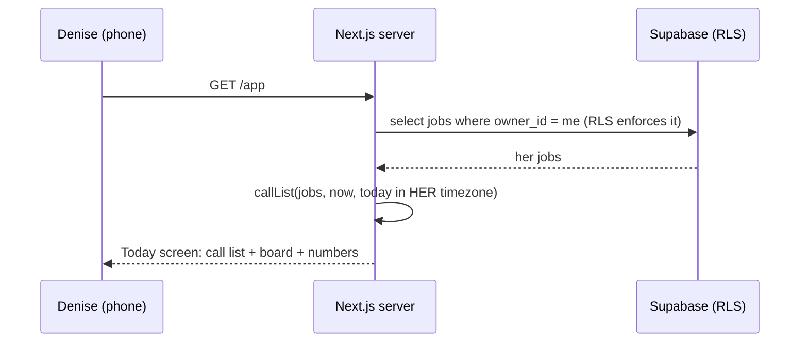
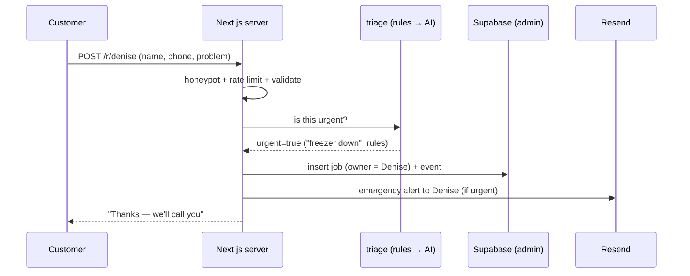

# System Design & Architecture — FollowUp

## 1. The big picture (simple)
```
   PEOPLE                         OUR APP (Next.js on Vercel)                 SERVICES
 ┌──────────┐  browser/phone   ┌──────────────────────────────────┐
 │ Denise   │ ───────────────► │ Pages (what she sees)            │
 │ Husband  │                  │  /            landing page        │
 └──────────┘                  │  /login /signup                   │
                               │  /app         ⭐ Today screen      │      ┌───────────────┐
 ┌──────────┐  public form     │  /app/jobs/new  add / paste       │ ───► │ Supabase      │
 │ Customer │ ───────────────► │  /app/jobs/[id] one job           │ ◄─── │ Postgres+Auth │
 └──────────┘  /r/denise       │  /r/[slug]    public request form │      └───────────────┘
                               │                                  │      ┌───────────────┐
                               │ Server logic (runs on Vercel)    │ ───► │ Groq (AI)     │
                               │  Server Actions: save/move jobs  │      └───────────────┘
                               │  lib/rules.ts: WHO TO CALL       │      ┌───────────────┐
                               │  lib/triage.ts: IS IT URGENT     │ ───► │ Resend (email)│
                               │  /api/cron/digest  (7 AM)        │      └───────────────┘
                               └──────────────────────────────────┘
                                          ▲ every morning
                                    Vercel Cron
```
**Hinglish mein:** browser/phone pe pages dikhte hain → server pe logic chalta hai → data Supabase mein save hota hai → zarurat pade toh AI (Groq) aur email (Resend) ko bulaate hain.

## 2. Architecture layers
| Layer | Folder | Rule |
|---|---|---|
| **UI** (pages & components) | `app/`, `components/` | Shows data; never talks to the DB directly from the browser for writes |
| **Actions** (what users do) | `lib/actions/` | Every change goes through a Server Action → validates input → writes job + event |
| **Domain logic** (pure, tested) | `lib/rules.ts`, `lib/triage.ts`, `lib/stages.ts` | No database, no network → easy to test and explain |
| **Data access** | `lib/db/` | Supabase clients: user client (RLS applies) vs admin client (server-only) |
| **Integrations** | `lib/ai/`, `lib/email/` | Each has a fallback; failures never block saving a job |

## 3. Key flows

### 3a. Denise opens the app in the morning


### 3b. A customer submits the public request form


### 3c. Paste a text message → job
```
paste text → /api/parse → cache hit? → else daily cap ok? → Groq (JSON) → validate fields
           → phone must appear in the text → fill the form → Denise checks → Save
```

### 3d. 7 AM digest
```
Vercel Cron (hourly) → /api/cron/digest (checks CRON_SECRET)
   → for each business where local time is 7 AM and digest enabled
   → callList() → email "6 people to call today" via Resend
```

## 4. Urgency triage design (AI with cost control)
```
text ─► RULES (free, instant): keyword lists
        ├─ strong urgent words ("down", "not cooling", "warm", "leak", "spoil", "emergency")  → URGENT (rules)
        ├─ clearly routine ("maintenance", "quote for", "annual", "new unit")                → NOT urgent (rules)
        └─ unsure → AI (Groq, 1 call, cached by hash, daily cap)                            → may RAISE to urgent
User can always toggle. AI can never LOWER a rules "urgent".
```
Why: the worst mistake is calling a real emergency "not urgent" (that's the lost $2,000). So the safe direction is built in.

## 5. Security model
- **RLS everywhere:** every query from a logged-in user runs as that user; Postgres itself refuses other owners' rows.
- **Two Supabase clients:** *user client* (anon key + session cookie; RLS applies) for the app; *admin client* (service-role key, **server only**) for the public form and cron, which have no logged-in user.
- **Guest demo:** anonymous Supabase user + seeded demo jobs; a guest can't see anyone else's data either.
- **AI input is untrusted data:** strict JSON output, every field validated, no tools/actions from AI output.
- **Secrets** only in Vercel env vars; never in the browser bundle (only `NEXT_PUBLIC_*` are public, by design).

## 6. Scaling note (for interviews)
Built for 1 shop (15–20 jobs/week). For 1,000 shops: same design works — indexes on `(owner_id, stage)`, the cron batches users by time zone, AI cache cuts repeat calls. Next bottleneck would be email volume → queue.
