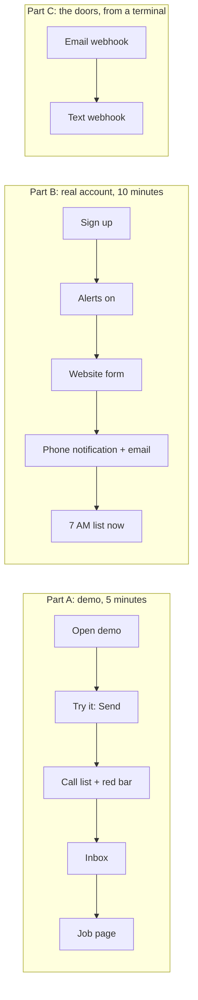

# How to check that everything works

Every automation in FollowUp, how to trigger it by hand, and what you should see. Part A needs nothing but a browser. Part B uses a real account, because the demo never sends email or notifications to strangers.

Live app: **https://followup-indol-seven.vercel.app**



---

## Part A: the demo (no signup)

| # | Do this | You should see |
|---|---|---|
| A1 | Open the site → **Try the demo** | Your own private copy with a week of sample jobs. The **Call list** says "N calls to make today", with a big **Call first** card. |
| A2 | Look at the top of any page | A dark bar: *Emergency waiting…* with **Call · Open · I'm on it**. Click once anywhere on the page: the alert sound is allowed to play from now on. |
| A3 | Sidebar → **Try it** → press **Send** on *A customer texts* | In a few seconds: "✓ It arrived as an emergency, and Denise was alerted." An alert sound plays. |
| A4 | Press **Send** on *A customer emails* | "✓ It arrived as a new job on the call list." (a price request isn't an emergency) |
| A5 | Press **Send** on *A customer leaves a voicemail* | It arrives as a job, filed as a phone call. |
| A6 | Press **See it on the call list** | The new emergency is in the Emergencies group; the red bar now says "+N more waiting". |
| A7 | Sidebar → **Inbox** | All three messages, in the customer's own words, with "Open job →". Filters by Calls / Texts / Emails / Website. |
| A8 | Open the emergency job → **I'm on it (stop alerts)** | The job leaves the red bar, and repeat alerts stop for it. |
| A9 | On any job, tap the next step (e.g. **Quote sent**), then **Undo: back to …** | The stage moves, then moves back. Both are in **History** at the bottom. |
| A10 | On a job, **No answer** | It leaves today's list and shows under **Coming up → Tomorrow**. |
| A11 | **Add a job** → paste: `Hi this is Tony from Tony's Deli, our walk-in cooler is at 50 degrees, call me 614-555-0199` → **Fill in the form** | Name, business, phone and problem fill in, and it's marked urgent. |
| A12 | On a job → **Draft a message** | A short, ready-to-send text. **Text** opens your phone's messages with the number filled in. |
| A13 | **Try it** → *See the emails Denise gets* | The emergency email and the 7 AM list email, exactly as they're sent. |
| A14 | **All jobs** → search a name; **Export CSV** | The job is found; a spreadsheet downloads. |
| A15 | **Numbers** → **Create a link** → open the link in a private window | A read-only Numbers page with no login and no customer names. **Turn the link off** → the link shows "not found". |
| A16 | **Add a job** → *Moving over from a notebook?* → paste 3 lines, e.g. `Joe's Diner - fan making noise - 614-555-0101` | A live preview of 3 jobs (emergencies marked), then **Add 3 jobs** → "Added 3 jobs to your call list". Paste again: "already there, skipped". |
| A17 | **Settings** → *Get alerts on your phone* | A QR code. Scan it with your phone camera: it opens a page with one **Turn on alerts** button. |
| A18 | **Settings → Connect phone & email** | Email and phone cards say "send the steps to your helper", with **Email the steps to my helper** and **Copy the steps**. No technical addresses on screen. |
| A19 | Sidebar → **Fresh sample jobs** | The demo resets to a clean sample week. |

## Part B: a real account (email, notifications, the website form)

**Before you start:** email is sent through Resend's test sender, which only delivers to **the email address that owns the Resend account**. Sign up with that address, or emails won't arrive (everything else still works).

| # | Do this | You should see |
|---|---|---|
| B1 | **Create an account** → confirm the email link | You're on an empty Call list with a short "Getting started" checklist. No **Try it** in the menu: real businesses get real requests. |
| B2 | **Settings** → business name + phone → Save | The checklist ticks the first step. |
| B3 | **Settings → Alerts on this device → Turn on** → allow notifications. For your phone: scan the QR code under *Get alerts on your phone*, log in, tap **Turn on alerts** | Status says "On". On iPhone, the page shows how to add it to the Home Screen first. |
| B4 | **Settings → Connect phone & email** → open the **website form link** in a private window → fill it in, tick **equipment is down** → Send | Within seconds: a **phone/computer notification** "EMERGENCY: …", a sound if the app is open, and an **email** titled "EMERGENCY: …". The job is on top of the Call list. |
| B5 | Do nothing for 3–6 minutes | Another notification: "Still waiting: EMERGENCY … N min and nobody has called back". It repeats every 3 minutes (max 10) until you call, move the job, or tap **I'm on it**. |
| B6 | Fill the form again without "equipment is down" | A normal "New request: …" notification and email. No repeats. |
| B7 | Copy the **referral link** (`…?ref=Tony`) and send a request through it | The job says "Referred by Tony". |
| B8 | **Settings → Send me today's list now** | The 7 AM email arrives now: "N calls to make today". Press it again: "already sent today" (it can never double-send). |
| B9 | Wait for 7 AM Eastern the next day | The list email and a notification "N calls to make today" arrive by themselves. |
| B10 | On a **Friday after 3 PM** (shop time), with open jobs | A blue "It's Friday. Clear these before the weekend." banner on the Call list, plus one notification and email "Before the weekend: N jobs still waiting on you". |

## Part C: the doors, from a terminal (optional)

Your private address is inside the steps: **Settings → Connect phone & email → Copy the steps** on the Email card, and paste them somewhere. It looks like `https://…/api/inbound/<token>/email`. Replace `<hook>` below with the part before `/email`.

**An email arriving** (what an email-forwarding service sends):

```bash
curl -X POST "<hook>/email" -H "Content-Type: application/json" -d '{"from":"Sam Ortiz <sam@harbordeli.example>","subject":"Freezer down","text":"Our walk-in freezer stopped this morning, can someone come today? Sam, Harbor Deli, 614-555-0123"}'
```

**A text arriving** (what Twilio sends; works without a signature only until Twilio keys are added):

```bash
curl -X POST "<hook>/sms" -d "From=+16145550123" --data-urlencode "Body=hi its Dana from Dana's Donuts, display cooler is warm, please call"
```

Each one shows up in the Inbox and on the Call list, with a notification. Send the same text twice: the second one is added to the **same job** ("They messaged you"), not a new one.

## Part D: the safety checks

| Check | Expected |
|---|---|
| Open `/app` while logged out | Sent to the login page |
| `curl https://followup-indol-seven.vercel.app/api/cron/realert` | `401 unauthorized` |
| `curl https://followup-indol-seven.vercel.app/api/cron/digest` | `401 unauthorized` |
| Send a text to `<hook>/sms` with a wrong token in the URL | `404` |
| Submit the website form 6 times in a row | The 6th is refused (5 per 10 minutes) |
| Open `/n/anything-made-up-1234567890` | "Not found" |
| Type `<b>hi</b>` as a customer name | Shown as text, never as bold, in the app and in emails |

## Automated tests

```bash
npm test           # 46 unit tests: call-list rules, Friday check, repeat alerts, message reading, signatures, emails
npm run e2e        # 4 browser tests in real Chrome (needs local Supabase)
npm run lint && npm run typecheck && npm run build
```
