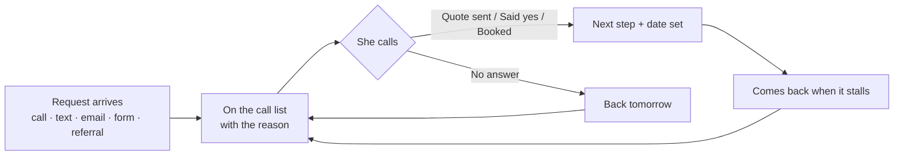

# FollowUp: the write-up

*What I heard from Denise, what I think the real problem is, what I built for it, and what I'd do next.*

**In one paragraph.** Denise doesn't need a CRM. She needs a list that can't forget anyone. FollowUp keeps every open job on a rule: if the customer is waiting on her, the job is on today's call list until she says what happened. Requests from all five places she gets them land on that same list by themselves, and an emergency keeps buzzing her phone until someone acts. Everything else in the app is secondary and stays out of her way.

[Live app](https://followup-indol-seven.vercel.app) · [4-minute narrated tour](https://followup-indol-seven.vercel.app/#tour) · [How to test every automation](TESTING.md) · [Edge cases](EDGE-CASES.md) · [Decisions log](DECISIONS.md)

---

## 1. What I heard

| Topic | Her words |
|---|---|
| The ask | "I just want to wake up and know who I need to call today… Waiting on quote, waiting on their yes, scheduled, done. That is it." |
| The cost | "A restaurant called on a Friday, freezer down, and I forgot to follow up… by Monday they had called someone else. That is a two thousand dollar job gone." |
| The cause | Requests come by calls to her cell, the website form, texts, referrals and a notebook. "It is a mess." |
| A second user | "My husband keeps asking me for numbers and I cannot even tell him how many open jobs we have." |
| The limits | 15–20 requests a week. "I don't need anything fancy." Tech scheduling is "nice later." |

## 2. Where the money actually leaks

She didn't lose the $2,000 job because she never got the call. **She got it and nothing brought it back** after her busy moment passed. So there are two problems, and the order matters:

1. **Forgetting to follow up (the expensive one).** A list she has to remember to check fails exactly when she's slammed. The fix is a list that rebuilds itself every morning from rules, and alerts that don't stop for emergencies.
2. **Requests scattered in five places.** A job only exists if she writes it down. The fix is making every channel drop into the same list by itself.

Fixing #1 alone would have saved the Friday job. Fixing #2 makes the list complete. I built #1 first and kept it the center of the app.

## 3. What I built, in order of importance

| # | What | Why (her words) |
|---|---|---|
| 1 | **Call list**: who to call today and why, emergencies first. One tap after each call sets when the job comes back. | "Wake up and know who I need to call today" |
| 2 | **Her stages**: New → Waiting on quote → Waiting on their yes → Scheduled → Done (or Lost, with a reason) | "Waiting on quote, waiting on their yes, scheduled, done" |
| 3 | **Emergency alerts**: phone notification + sound + email, repeated every 3 minutes until someone taps "I'm on it" or calls | The Friday freezer job |
| 4 | **Friday 3 PM check**: anything still on the list or due Saturday–Monday gets one reminder before the weekend | "By Monday they had called someone else" |
| 5 | **All five channels in one place**: website form and referral links work now; email, texts and calls (recorded and written out) work once forwarding / a phone number is connected | "Scattered in five places" |
| 6 | **7 AM list** by email and phone notification | "Wake up and know…" |
| 7 | **Numbers**: open jobs, money waiting on a yes, wins, losses and why, time to call back | Her husband's question |
| 8 | **Tech + arrival window** on a booked visit, and a 14-day view | "Nice later", so it's kept to one field on the job, not a dispatch system |

**What Denise sees on day one:** the Call list. Everything else is one tap away and can be ignored. The **Try it** page (pretend to be a customer) appears only in the demo, because a real business gets real requests.

## 4. Decisions that matter

- **Rules decide the call list, not AI.** Who's on it and why is plain, tested code (`lib/rules.ts`), so she can always see the reason. AI only reads messy messages into fields and drafts replies.
- **AI can raise urgency, never lower it.** Missing an emergency costs about $2,000; a false alarm costs one phone call.
- **Nothing leaves the list silently.** "No answer" brings it back tomorrow; after 3 tries it *suggests* marking it lost, but never does it by itself.
- **One pipeline for every channel** (`lib/ingest.ts`), so a text and a website request behave the same, and the customer's own words are always stored.
- **Trust depends on where it came from.** Caller ID verified by Twilio can match an existing customer; a phone number typed into the public form can't change another customer's job.
- **She sends messages, not the app.** FollowUp drafts the text; she sends it from her own phone. Customers know her number.

Full log with the rejected options: [DECISIONS.md](DECISIONS.md).

## 5. What I chose not to build

- **Dispatch and route planning.** She said she knows where everyone is.
- **Sending quotes and invoices.** She asked to *track* quotes. Her husband does the books.
- **Automatic texts to customers.** Her relationships are personal, and US texting rules (A2P registration) apply.
- **Charts for their own sake.** Every number answers a question someone asked.

## 6. How I'd roll it out

| When | What happens | Her time |
|---|---|---|
| Day 1 | Account, business name and phone. Copy open jobs from the notebook by pasting each line (the fields fill in). Put the request-form link on the website. | 20 min |
| Week 1 | She only uses the Call list. I check in on Friday: did anything get missed? | 0 |
| Week 2 | Forward the website-form inbox to FollowUp, so emails become jobs. | 10 min |
| Week 3 | Get a business number (Twilio) that rings her cell. Calls get recorded and written out, and texts land on the right job. | 15 min |
| Week 4 | Review the Numbers page with her husband. Decide whether techs need their own view. | 30 min |

## 7. What it costs to run

| Item | About |
|---|---|
| Hosting (Vercel) + database (Supabase) | $0 on free plans; ~$20/month on Vercel Pro once it's a paid business tool |
| AI (Groq) | Under $1/month at 20 jobs a week; works without AI too |
| Email (Resend) | $0 up to 3,000/month; needs her domain verified (~$12/year if she has none) |
| Phone number + texts + call recording (Twilio) | ~$2–5/month at her volume, plus one-time texting registration |

## 8. How we'd know it works

- **Time to call back** (shown on the Call list): from hours to under 2 hours for new requests.
- **Zero jobs lost to "never heard back"** (lost reasons are tracked).
- **Friday check is clear** before she leaves.
- Her husband gets his number without asking her.

## 9. Questions I'd ask Denise next

1. Which number do customers call today? Can we forward it through a business number, or should only missed calls come in?
2. What runs the website form (Wix, WordPress, something else)? Can it send each request to a link?
3. Who else answers the phone or the inbox? Do they need their own login?
4. Besides "equipment down", what makes a job urgent? A temperature? A type of customer?
5. Are you OK with calls being recorded? (Some states need both sides to agree.)
6. When does your day start, and where do you want the list: email, a phone notification, or a text?
7. How do you send quotes today, and how long do customers usually take to answer?

## 10. Honest limits

- **Calls and texts** are fully built and signature-checked, but need a real phone number to go live. Until then they're tested through the simulator.
- **Email sending** uses Resend's test sender, which only delivers to the account owner. A verified domain fixes that.
- **One login per business.** Per-person logins come before the office or techs use it.
- **iPhone notifications** need the app added to the Home Screen (iOS 16.4+).
